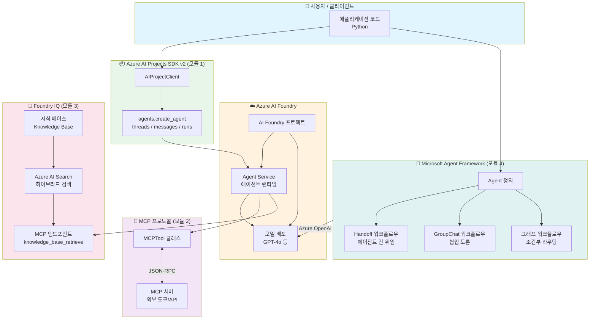
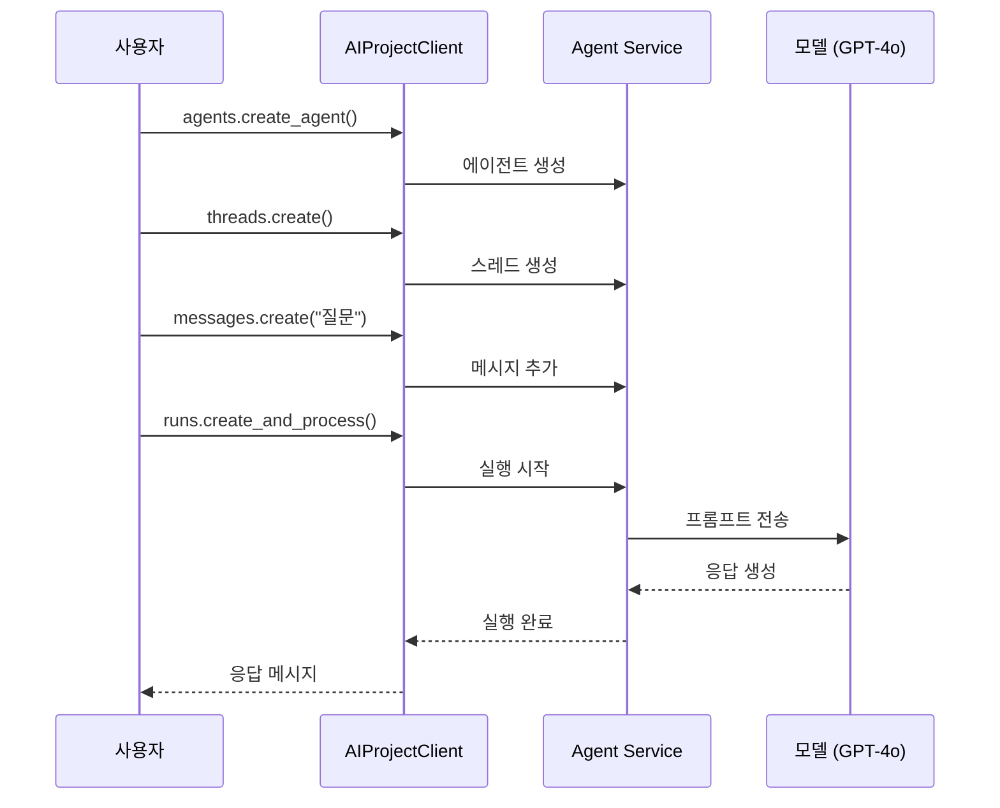
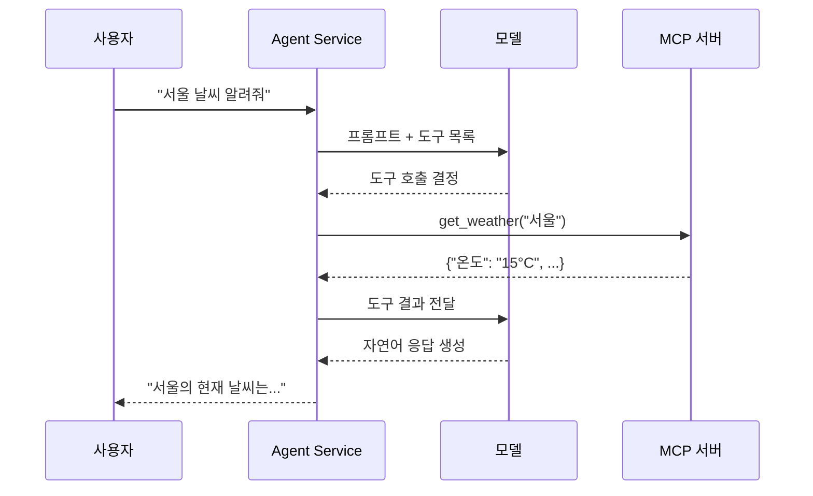
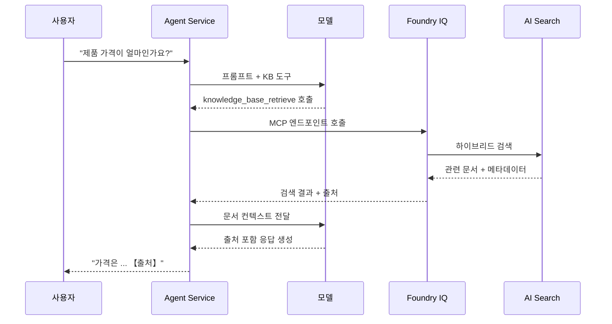
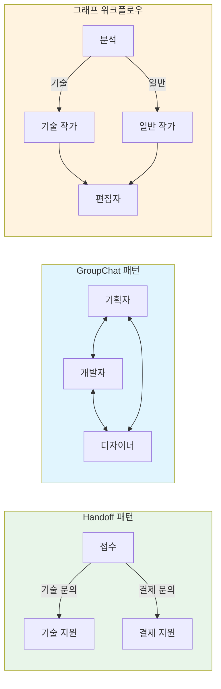

# 전체 아키텍처

이 문서는 실습 가이드에서 다루는 Microsoft AI Agent 기술 스택의 전체 아키텍처를 설명합니다.

## 기술 스택 관계도

## 모듈별 데이터 흐름

### 모듈 1: Agent SDK v2 기본 흐름

### 모듈 2: MCP 서버 연결 흐름

### 모듈 3: Foundry IQ RAG 흐름

### 모듈 4: Agent Framework 워크플로우 패턴

## 기술 스택 요약

| 계층 | 기술 | 패키지 | 역할 |
|------|------|--------|------|
| **SDK** | Azure AI Projects SDK v2 | `azure-ai-projects>=2.0.0` | Foundry 에이전트 생성/관리 |
| **인증** | Azure Identity | `azure-identity` | DefaultAzureCredential |
| **도구 연결** | MCP (Model Context Protocol) | `mcp[cli]` | 외부 도구/API 연결 표준 |
| **지식 검색** | Foundry IQ + AI Search | 포털 설정 | Agentic RAG |
| **워크플로우** | Microsoft Agent Framework | `agent-framework` | 멀티에이전트 오케스트레이션 |
| **모델** | Azure OpenAI | `openai` | GPT-4o 등 LLM |
