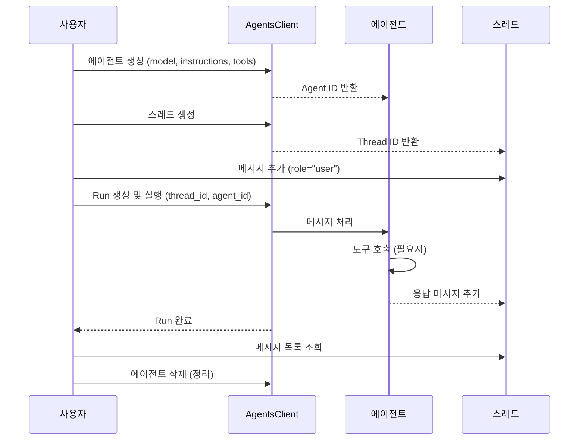

# 모듈 1: Azure AI Foundry Agent SDK v2 기본

## 🎯 학습 목표

이 모듈을 완료하면 다음을 할 수 있습니다:

- Azure AI Foundry Agent SDK v2의 핵심 개념(Agent, Thread, Message, Run)을 이해한다
- 기본 에이전트를 생성하고 대화할 수 있다
- Code Interpreter 도구를 사용하여 코드 실행이 가능한 에이전트를 만들 수 있다
- File Search 도구를 사용하여 문서 기반 Q&A 에이전트를 만들 수 있다

---

## 📚 핵심 개념

Azure AI Foundry Agent SDK v2는 AI 에이전트를 생성하고 관리하기 위한 Python SDK입니다. 다음 네 가지 핵심 개념을 이해해야 합니다.

### Agent (에이전트)

에이전트는 AI 모델, 지침(instructions), 도구(tools)를 결합한 실행 단위입니다. 에이전트를 생성할 때 다음을 지정합니다:

- **model**: 사용할 AI 모델 (예: gpt-4o)
- **name**: 에이전트의 이름
- **instructions**: 에이전트의 행동을 정의하는 시스템 프롬프트
- **tools**: 에이전트가 사용할 수 있는 도구 (Code Interpreter, File Search 등)

### Thread (스레드)

스레드는 에이전트와 사용자 간의 대화 세션입니다. 하나의 스레드에 여러 메시지를 추가할 수 있으며, 대화의 컨텍스트가 유지됩니다.

### Message (메시지)

메시지는 스레드 내의 개별 대화 항목입니다. 사용자(`user`) 또는 에이전트(`assistant`) 역할로 구분됩니다.

### Run (실행)

Run은 에이전트가 스레드의 메시지를 처리하는 실행 단위입니다. Run을 생성하면 에이전트가 스레드의 메시지를 읽고, 도구를 호출하고, 응답을 생성합니다.

### 라이프사이클 흐름

```
Agent 생성 → Thread 생성 → Message 추가 → Run 실행 → 응답 확인 → (반복) → 정리(삭제)
```



---

## 🔧 사전 준비

### 1. Azure AI Foundry 프로젝트 설정

Azure AI Foundry에서 프로젝트를 생성하고, 다음 정보를 확인합니다:

- **PROJECT_ENDPOINT**: 프로젝트 엔드포인트 URL
  - Azure AI Foundry 포털 → 프로젝트 → 설정 → 프로젝트 엔드포인트에서 확인
  - 형식: `https://<resource-name>.services.ai.azure.com/api/projects/<project-name>`
- **MODEL_DEPLOYMENT_NAME**: 배포된 모델 이름 (예: `gpt-4o`)

### 2. 환경 변수 설정

프로젝트 루트 디렉토리(`../.env`)에 `.env` 파일을 생성합니다:

```env
PROJECT_ENDPOINT=https://your-resource.services.ai.azure.com/api/projects/your-project
MODEL_DEPLOYMENT_NAME=gpt-4o
```

### 3. Python 패키지 설치

```bash
# 프로젝트 루트에서 실행
pip install -r requirements.txt
```

필요한 주요 패키지:

| 패키지 | 버전 | 용도 |
|--------|------|------|
| `azure-ai-agents` | >= 1.0.0 | Agent SDK v2 (`AgentsClient`) |
| `azure-identity` | 최신 | Azure 인증 |
| `python-dotenv` | 최신 | 환경 변수 로드 |

### 4. Azure 인증

`DefaultAzureCredential`을 사용하여 인증합니다. 다음 중 하나의 방법으로 로그인하세요:

```bash
# Azure CLI를 사용한 로그인
az login
```

---

## 🧪 실습 1: 기본 에이전트 생성 및 대화

> **파일**: `01_hello_agent.py`

이 실습에서는 가장 기본적인 에이전트를 생성하고, 간단한 대화를 수행합니다.

### 실행 방법

```bash
cd module1-agent-sdk
python 01_hello_agent.py
```

### 코드 설명

1. **AgentsClient 생성**: `PROJECT_ENDPOINT`와 `DefaultAzureCredential`을 사용하여 클라이언트를 초기화합니다.

2. **에이전트 생성**: `client.create_agent()`로 에이전트를 만듭니다. `instructions`에 에이전트의 역할과 행동을 정의합니다.

3. **스레드 생성**: `client.threads.create()`로 대화 스레드를 만듭니다.

4. **메시지 추가**: `client.messages.create()`로 사용자 메시지를 스레드에 추가합니다.

5. **Run 실행**: `client.runs.create_and_process()`로 에이전트가 메시지를 처리하도록 합니다. 이 메서드는 Run이 완료될 때까지 자동으로 폴링합니다.

6. **응답 확인**: `client.messages.list()`로 스레드의 메시지를 조회하고, 에이전트의 응답을 출력합니다.

7. **정리**: `client.delete_agent()`로 에이전트를 삭제합니다.

### 예상 출력

```
에이전트 생성 완료: agent_xxxxx
스레드 생성 완료: thread_xxxxx
메시지 추가 완료
Run 실행 완료 - 상태: completed
=== 에이전트 응답 ===
[assistant]: 안녕하세요! 저는 여러분의 AI 도우미입니다. ...
에이전트 삭제 완료
```

---

## 🧪 실습 2: Code Interpreter 도구 사용

> **파일**: `02_agent_with_tools.py`

이 실습에서는 Code Interpreter 도구를 사용하여 에이전트가 Python 코드를 실행하고 계산을 수행하도록 합니다.

### Code Interpreter란?

Code Interpreter는 에이전트가 Python 코드를 작성하고 실행할 수 있게 해주는 내장 도구입니다. 다음과 같은 작업에 활용할 수 있습니다:

- 수학 계산 및 데이터 분석
- 차트/그래프 생성
- 파일 변환 및 처리
- 코드 실행 및 결과 반환

### 실행 방법

```bash
python 02_agent_with_tools.py
```

### 코드 설명

1. **도구 지정**: `CodeInterpreterTool()` 인스턴스를 만들고, 에이전트 생성 시 `tools=code_interpreter.definitions`로 전달합니다.

2. **계산 요청**: 사용자 메시지로 수학 문제를 전달합니다.

3. **Run 실행**: 에이전트가 Code Interpreter를 호출하여 Python 코드로 계산을 수행합니다.

4. **Run Steps 확인**: `client.run_steps.list()`로 에이전트가 수행한 단계를 확인할 수 있습니다. 도구 호출 내역과 코드 실행 결과를 볼 수 있습니다.

### 예상 출력

```
에이전트 생성 완료 (Code Interpreter 활성화): agent_xxxxx
...
=== 에이전트 응답 ===
[assistant]: 피보나치 수열의 처음 20개 항은 다음과 같습니다:
0, 1, 1, 2, 3, 5, 8, 13, 21, 34, 55, 89, 144, ...

=== Run Steps ===
Step 1: tool_calls - code_interpreter
Step 2: message_creation
```

---

## 🧪 실습 3: File Search 도구 사용

> **파일**: `03_agent_with_file_search.py`

이 실습에서는 File Search 도구를 사용하여 업로드된 문서의 내용을 검색하고 답변하는 에이전트를 만듭니다.

### File Search란?

File Search는 에이전트가 업로드된 파일(PDF, DOCX, TXT 등)의 내용을 벡터 검색하여 관련 정보를 찾을 수 있게 해주는 도구입니다. 내부적으로 다음 과정을 거칩니다:

1. 파일을 청크(chunk)로 분할
2. 각 청크를 임베딩 벡터로 변환
3. 벡터 스토어에 저장
4. 쿼리와 유사한 청크를 검색하여 컨텍스트로 제공

### 실행 방법

```bash
python 03_agent_with_file_search.py
```

### 코드 설명

1. **벡터 스토어 생성**: `client.vector_stores.create()`로 벡터 스토어를 생성합니다.

2. **파일 업로드**: 샘플 텍스트 파일을 생성하고 `client.files.upload()`으로 업로드한 뒤, `client.vector_store_file_batches.create_and_poll()`으로 벡터 스토어에 등록합니다.

3. **에이전트 생성**: `FileSearchTool(vector_store_ids=[...])` 인스턴스를 만들고, `tools=file_search.definitions`와 `tool_resources=file_search.resources`로 벡터 스토어를 연결합니다.

4. **질문 및 응답**: 업로드된 문서 내용에 대한 질문을 하면, 에이전트가 File Search를 통해 관련 내용을 찾아 답변합니다.

5. **정리**: 벡터 스토어와 에이전트를 삭제합니다.

### 예상 출력

```
벡터 스토어 생성 완료: vs_xxxxx
파일 업로드 완료: file_xxxxx
에이전트 생성 완료 (File Search 활성화): agent_xxxxx
...
=== 에이전트 응답 ===
[assistant]: Azure AI Foundry는 Microsoft의 AI 개발 플랫폼으로, ...
벡터 스토어 삭제 완료
에이전트 삭제 완료
```

---

## 📝 핵심 정리

| 개념 | 설명 |
|------|------|
| **AgentsClient** | Azure AI Foundry 에이전트 서비스에 연결하는 클라이언트 |
| **Agent** | AI 모델 + 지침 + 도구를 결합한 실행 단위 |
| **Thread** | 대화 세션 (컨텍스트 유지) |
| **Message** | 스레드 내 개별 메시지 (user/assistant) |
| **Run** | 에이전트의 메시지 처리 실행 |
| **Code Interpreter** | Python 코드 실행 도구 |
| **File Search** | 벡터 검색 기반 문서 검색 도구 |

### SDK v2 주요 패턴

```python
# 1. 클라이언트 생성
client = AgentsClient(endpoint=endpoint, credential=credential)

# 2. 에이전트 생성
agent = client.create_agent(model=model, name="...", instructions="...")

# 3. 대화 실행
thread = client.threads.create()
client.messages.create(thread_id=thread.id, role="user", content="...")
run = client.runs.create_and_process(thread_id=thread.id, agent_id=agent.id)

# 4. 응답 확인
messages = client.messages.list(thread_id=thread.id)

# 5. 정리
client.delete_agent(agent.id)
```

---

## ➡️ 다음 단계

[모듈 2: MCP 서버 구축](../module2-mcp-server/README.md)에서는 Model Context Protocol(MCP)을 사용하여 에이전트에 외부 도구를 연결하는 방법을 학습합니다.
